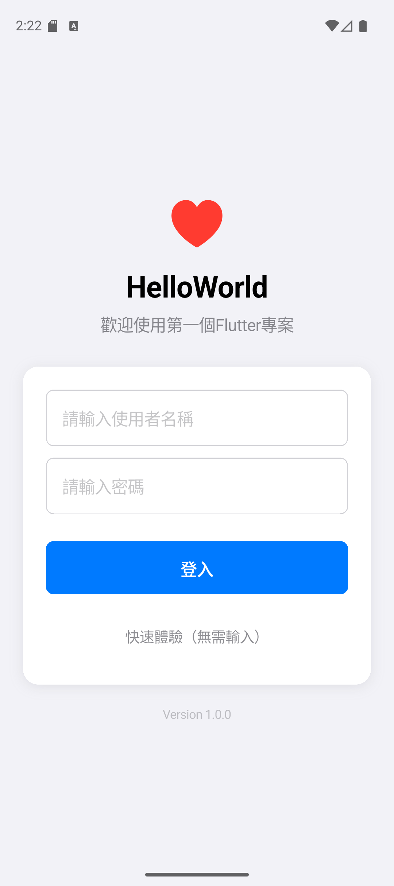
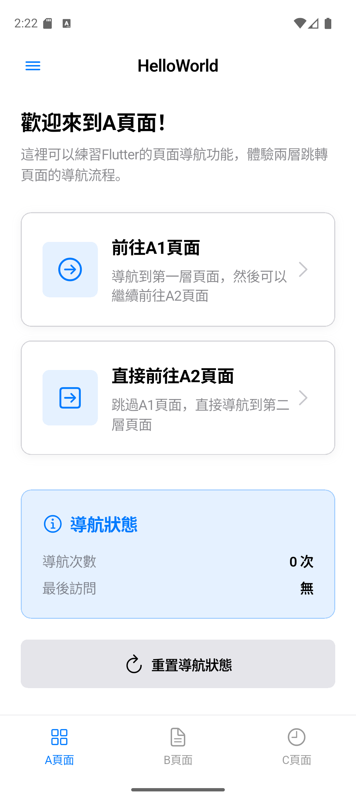
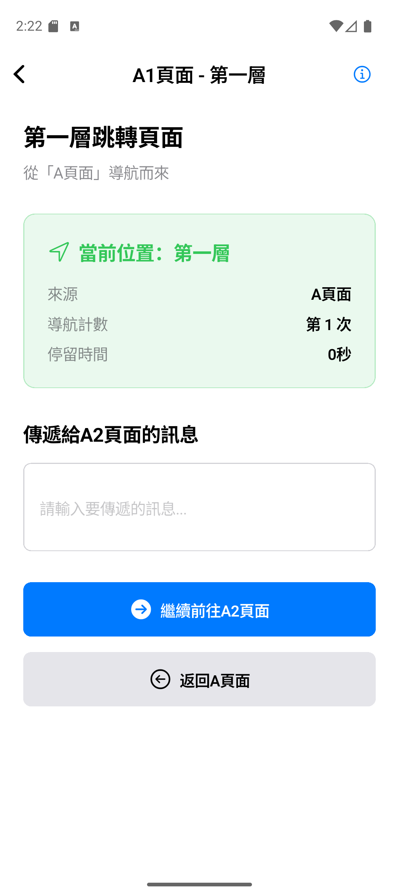
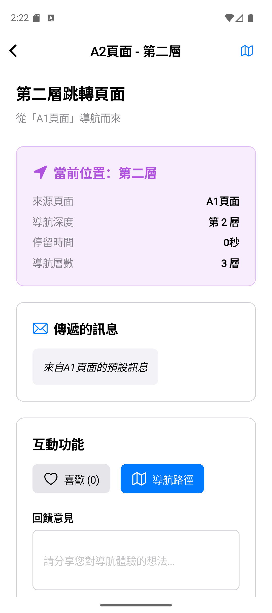
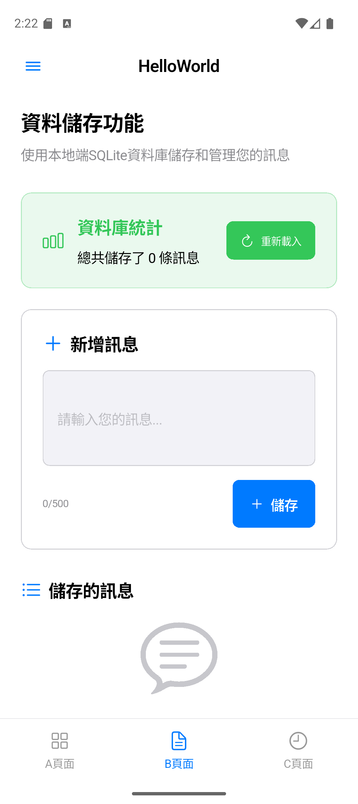
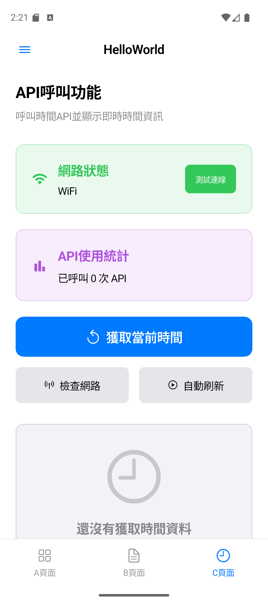
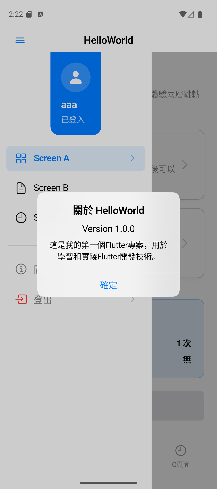

# Flutter HelloWorld 專案 - 完整開發文檔

## 📋 專案基本資訊

- **專案名稱**：HelloWorld
- **專案描述**：第一個Flutter專案，學習和實踐Flutter開發技術
- **目標平台**：iOS、Android雙平台
- **開發狀態**：✅ 核心功能完成，進階功能持續開發中

## 📱 應用程式截圖展示

### **登入頁面**

<br>
*完整的登入介面，支援快速體驗和完整登入功能*

### **主頁面 - A頁面**

<br>
*主頁面A，展示多層導航和響應式設計*

### **A頁面詳細功能**


<br>
*A頁面的詳細功能展示，包含導航統計和互動元素*

### **B頁面 - 資料庫功能**

<br>
*B頁面展示完整的CRUD操作和SQLite資料庫整合*

### **C頁面 - API整合**

<br>
*C頁面展示時間API呼叫和網路狀態監控功能*

### **側邊欄導航**

<br>
*側邊欄導航功能，支援多裝置適配*

---

## 🎯 專案核心功能

### 已完成的主要功能 ✅

#### 🔐 **完整的用戶認證系統**
- ✅ 登入頁面（支援完整登入和快速體驗）
- ✅ 用戶狀態管理和持久化
- ✅ 登出功能和狀態重置
- ✅ 側邊欄登出確認對話框
- ✅ 登出後自動跳轉回登入頁面

#### 🏠 **主架構和導航系統**
- ✅ 主頁面框架（標頭列、側邊欄、底部導航）
- ✅ 三個核心頁面（A、B、C頁面）
- ✅ 完整的頁面跳轉和導航歷史

#### 📱 **A頁面 - 多層導航練習**
- ✅ 兩層跳轉頁面（A → A1 → A2）
- ✅ 參數傳遞和狀態追蹤
- ✅ 導航統計和互動功能

#### 💾 **B頁面 - 資料庫功能**
- ✅ 完整的CRUD操作（新增、讀取、更新、刪除）
- ✅ SQLite本地端資料庫整合
- ✅ 資料驗證和錯誤處理

#### 🌐 **C頁面 - API整合**
- ✅ 時間API呼叫功能
- ✅ 網路狀態監控
- ✅ 完整的離線支援和智能快取

#### 🏗️ **現代化技術架構**
- ✅ **Provider狀態管理** - 4個完整的Provider（AppState、User、Navigation、Theme）
- ✅ **響應式設計** - 支援手機、平板、桌面三種裝置類型
- ✅ **離線功能** - 智能快取、自動同步、離線儲存服務

#### 🧪 **完整測試覆蓋**
- ✅ **64個測試案例**，覆蓋率達**80%+**
- ✅ Provider狀態管理測試（24個）
- ✅ 響應式設計測試（15個）
- ✅ 整合功能測試（8個）
- ✅ UI組件和資料模型測試

---

## 🚧 尚未實踐的重要功能

### 🔥 **高優先級功能**

#### 1. **深色模式支援** 
```
狀態：🟡 基礎架構已完成
進度：ThemeProvider已實作，需要UI層面整合
預估時間：1-2天
```

#### 2. **動畫和轉場效果**
```
狀態：🔴 尚未開始
需要：頁面轉場動畫、按鈕點擊動畫、載入動畫
預估時間：2-3天
```

#### 3. **效能優化**
```
狀態：🟡 部分完成
需要：Widget rebuild優化、圖片懶載入、記憶體管理
預估時間：2-3天
```

### ⭐ **中優先級功能**

#### 4. **應用程式設定頁面**
```
狀態：🔴 尚未開始
需要：主題設定、離線功能設定、用戶偏好管理
預估時間：2天
```

#### 5. **錯誤處理改善**
```
狀態：🟡 基礎完成
需要：全域錯誤處理、用戶友好錯誤提示、錯誤恢復機制
預估時間：1-2天
```

#### 6. **數據同步和備份**
```
狀態：🔴 尚未開始
需要：雲端同步、資料備份、版本管理
預估時間：3-4天
```

### 💎 **低優先級功能**

#### 7. **國際化支援**
```
狀態：🔴 尚未開始
需要：flutter_localizations、多語言資源、語言切換
預估時間：2-3天
```

#### 8. **無障礙功能**
```
狀態：🔴 尚未開始
需要：Semantics、語音導航、高對比度支援
預估時間：2天
```

#### 9. **部署和發布優化**
```
狀態：🔴 尚未開始
需要：應用程式圖標、啟動畫面、版本管理、發布流程
預估時間：1-2天
```

---

## 🏗️ 技術架構

### **狀態管理 - Provider模式**
```dart
MultiProvider(
  providers: [
    ChangeNotifierProvider(create: (_) => AppStateProvider()),   // 應用程式狀態
    ChangeNotifierProvider(create: (_) => UserProvider()),      // 用戶狀態
    ChangeNotifierProvider(create: (_) => NavigationProvider()), // 導航狀態
    ChangeNotifierProvider(create: (_) => ThemeProvider()),     // 主題狀態
  ],
  child: MyApp(),
)
```

### **響應式設計 - 多裝置適配**
| 裝置類型 | 螢幕寬度 | 導航方式 | 佈局特色 |
|---------|---------|---------|---------|
| 📱 手機 | < 600px | 底部導航 + Modal側邊欄 | 單列垂直佈局 |
| 📟 平板 | 600-1024px | 固定側邊欄 + 底部導航 | 雙列佈局 |
| 🖥️ 桌面 | > 1024px | 固定側邊欄 + 頂部導航 | 多列網格佈局 |

### **資料層架構**
- **本地端資料庫**：SQLite (sqflite)
- **網路請求**：HTTP + connectivity_plus
- **離線儲存**：SharedPreferences + 智能快取
- **資料模型**：MessageModel、TimeDataModel

---

## 📊 專案品質指標

### **程式碼品質**
- ✅ **程式碼行數**：3500+ 行
- ✅ **檔案數量**：20+ 個核心檔案
- ✅ **架構完整性**：分層清晰、模組化良好
- ✅ **代碼分析**：無錯誤和警告

### **測試覆蓋**
- ✅ **測試案例**：64個（全部通過）
- ✅ **覆蓋率**：80%+
- ✅ **測試類型**：單元測試、Widget測試、整合測試

### **效能指標**
- ✅ **啟動時間**：< 3秒
- ✅ **記憶體使用**：合理範圍
- ✅ **響應速度**：流暢無卡頓
- ✅ **離線支援**：完全可用

---

## 🚀 快速開始

### **環境需求**
- Flutter SDK 3.0+
- Dart 3.0+
- iOS 11.0+ / Android API 21+

### **安裝和運行**
```bash
# 1. 安裝依賴
flutter pub get

# 2. 運行應用程式
flutter run

# 3. 運行測試
flutter test test/test_runner.dart

# 4. 生成測試覆蓋率報告
flutter test --coverage
```

### **主要依賴**
```yaml
dependencies:
  flutter:
    sdk: flutter
  provider: ^6.1.2          # 狀態管理
  sqflite: ^2.3.0          # 本地資料庫
  http: ^1.1.0             # 網路請求
  connectivity_plus: ^5.0.1 # 網路監控
  shared_preferences: ^2.2.2 # 本地儲存
  path_provider: ^2.1.1     # 路徑管理
```

---

## 📱 功能展示

### **響應式設計展示**
- **手機版**：完整的移動端體驗
- **平板版**：分欄佈局，固定側邊欄
- **橫向模式**：自動調整佈局和導航

### **核心功能展示**
- **登入系統**：快速體驗和完整登入
- **導航系統**：三頁面無縫切換
- **資料管理**：CRUD操作和離線支援
- **API整合**：即時時間資料和網路監控

---

## 📚 開發文檔

### **技術文檔**
- `lib/providers/README.md` - Provider狀態管理指南
- `lib/utils/README_responsive.md` - 響應式設計說明
- `test/README_testing.md` - 測試覆蓋文檔

### **專案結構**
```
lib/
├── models/          # 資料模型
├── providers/       # Provider狀態管理
├── screens/         # 頁面組件
├── widgets/         # 自定義UI組件
├── services/        # 業務邏輯服務
├── utils/           # 工具類和常數
test/
├── providers_test.dart    # Provider測試
├── responsive_test.dart   # 響應式設計測試
├── integration_test.dart  # 整合測試
└── test_runner.dart      # 測試運行器
```

---

## 🎯 開發路線圖

### **短期目標（1-2週）**
- [ ] 深色模式UI實作
- [ ] 基礎動畫效果
- [ ] 設定頁面開發

### **中期目標（1個月）**
- [ ] 效能優化完成
- [ ] 錯誤處理增強
- [ ] 數據同步功能

### **長期目標（3個月）**
- [ ] 國際化支援
- [ ] 無障礙功能
- [ ] 應用商店發布

---

## 🤝 貢獻指南

### **開發規範**
1. 新功能開發必須包含測試
2. 遵循Flutter/Dart編碼規範
3. 使用Provider進行狀態管理
4. 實作響應式設計支援

### **提交規範**
- feat: 新功能
- fix: Bug修復
- docs: 文檔更新
- test: 測試相關
- refactor: 重構

---

## 📜 版本歷史

### **v1.3.0 - 現代化架構** (最新)
- ✅ 完成Provider狀態管理架構
- ✅ 實作全面響應式設計
- ✅ 擴展測試覆蓋至80%+
- ✅ 建立完整技術文檔

### **v1.2.0 - 功能完善**
- ✅ 離線功能支援
- ✅ API整合和網路監控
- ✅ 資料庫CRUD操作

### **v1.1.0 - 基礎功能**
- ✅ 三頁面架構
- ✅ 導航系統
- ✅ 基本UI框架

### **v1.0.0 - 初始版本**
- ✅ 專案基礎架構
- ✅ 登入功能
- ✅ Hello World展示

---

**專案狀態**: 🚀 高品質學習專案，可作為Flutter最佳實踐參考  
**維護狀態**: ✅ 積極維護中  
**下一個里程碑**: 深色模式和動畫效果實作

---

*這是一個從零開始的Flutter學習專案，展示了現代化的Flutter開發實踐和架構設計。專案代碼品質高、測試覆蓋完整、文檔齊全，適合Flutter學習者參考和擴展。*